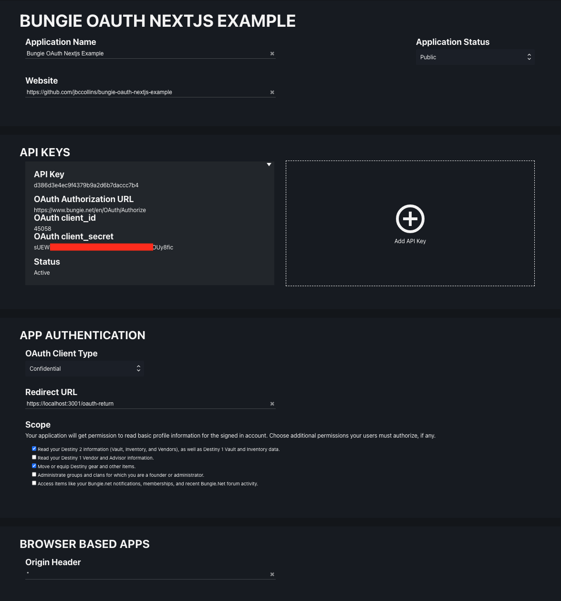

# Bungie OAuth Next.js Example

## About
This is a [Next.js](https://nextjs.org/) project bootstrapped with [`create-next-app`](https://github.com/vercel/next.js/tree/canary/packages/create-next-app).

The project is a bare-bones app containing nothing more than what is required to do OAuth and a few examples of making authenticated requests.

## Getting Started

First, install the dependencies

```bash
npm install
```

#### Create your own bungie.net app
First, create an application at Bungie.net.
here, specifically: https://www.bungie.net/en/Application.
you may need to re-visit this ^ link after logging in, it tends to dump you at the site root after login.

Set up your project to look like this screenshot. Note that you can name the application whatever you want and the website can be whatever you want. But everything else needs to match this screenshot.



Next, in the root of this project create a new file called `.env.local`.
Copy the contents of `.env.example` into `.env.local`.
Reference the above screenshot to replace values in `.env.local` as follows:

`NEXT_PUBLIC_BNET_API_KEY` => `API Key`,
`NEXT_PUBLIC_BNET_OAUTH_CLIENT_ID` => `OAuth client_id`,
`BNET_OAUTH_CLIENT_SECRET` => `OAuth client_id`

#### Local SSL
Bungie's OAuth setup *REQUIRES* that you use `https`, even when developing locally. You *CANNOT* use `http`. Next.js does not supoort using `https` locally out of the box. To get `https` working locally we need to create and use a locally-trusted SSL certificate.

Follow these steps: (All commands should be run from the root directory of your project)
##### Mac
First install `mkcert`; a tool that we will use to create a locally-trusted SSL certificate.
`brew install mkcert`

Next create a "Certificate Authority" and add it's certificate to your system's trust store.
`mkcert -install`

Finally create an SSL Certificate for `localhost`
`mkcert localhost`

Verify that the two files `localhost-key.pem` and `localhost.pem` were created in the root directory of your project.

##### Windows
- IDFK if you know pls contribute

## Run The App
Run the development server:

```bash
npm run dev
```

and open [https://localhost:3001](https://localhost:3001) in your browser

## Other Useful Things To Know
- [destinysets.com](https://data.destinysets.com)
- [VSCode extension](https://marketplace.visualstudio.com/items?itemName=d2api.d2-defs-lookup)
- [paracausal.science](https://paracausal.science/guide/api/app-setup)

## Attribution
A bunch of this code is directly copy/pasted from DIM. Thank you DIM devs :)